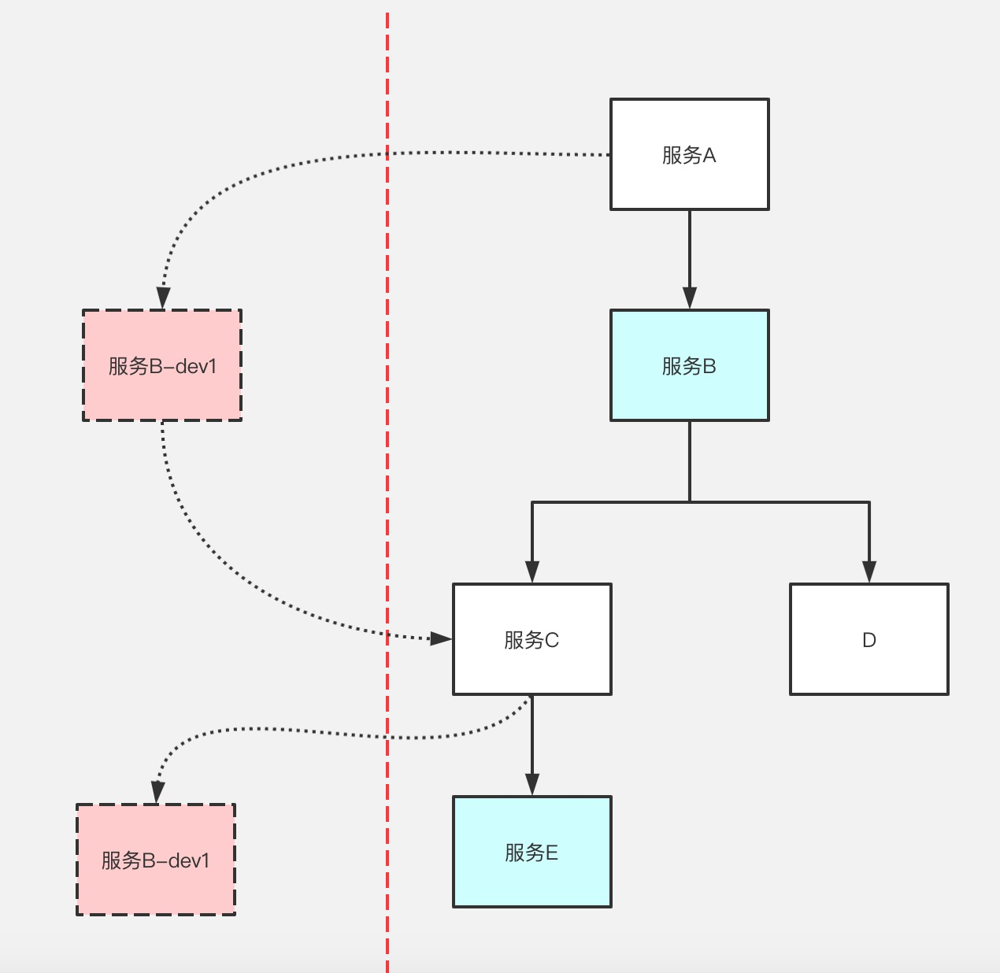

### 学习笔记
#### 注册中心接入后为什么还需要健康检查

注册与服务 ---> 服务发现(服务与注册中心通讯)

服务与服务 ---> 健康检查(服务与服务通讯)

#### 健康检查作用
平滑发布
兜底

#### 客户端发现
服务 -> 服务

#### 服务端发现
服务 -> LB(负载均衡) -> 服务

### 多租户

上图中虚线右半部分为基础服务(稳定版本), 右侧为我们的dev新开发分支. 
请求入口为服务A, header中加入 dev1 标签, 在判断当中如果包含 dev1 标签检测是否有在运行服务,
如果存在则转入左侧请求, 如果为发现则为右侧基础版本。 dev1 标签贯穿整个请求流程生命周期.
 

适用场景: 多测评环境、灰度发布、压测

### 图解回收垃圾
https://zhuanlan.zhihu.com/p/297177002?utm_source=wechat_session&utm_medium=social&utm_oi=26711194337280&utm_campaign=shareopn

### 注册中心 (bilibili)
https://github.com/bilibili/discovery

### 问题列表
https://shimo.im/docs/x8dxHkQRcdCHX8j3/read

https://shimo.im/docs/WxJp66WCtjVwKDK3